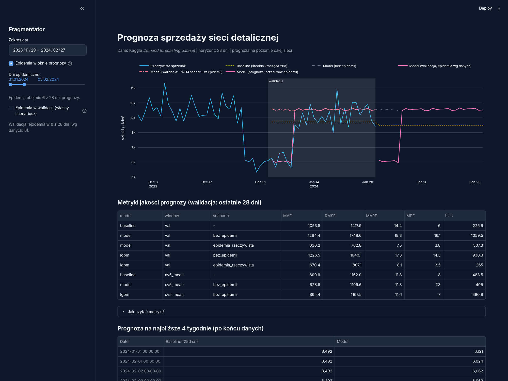

# Prognoza sprzedaży — Demand Forecasting

Prognoza dziennej sprzedaży sieci detalicznej (`Units Sold`, sztuki) na najbliższe 4 tygodnie,
z uwzględnieniem czynników zewnętrznych — z aplikacją webową w Streamlicie.

## Dane

[Demand forecasting dataset](https://www.kaggle.com/datasets/raminhuseyn/demand-forecasting-dataset)
(Kaggle, pobieranie przez `kagglehub`): 76 000 transakcji — 5 sklepów × 20 produktów × 760 dni
(2022-01-01 → 2024-01-30, brak luk w kalendarzu).

Agregacja do **dziennego szeregu sieciowego**: suma `Units Sold` po sklepach i produktach
(760 punktów). Szczegóły agregacji zmiennych zewnętrznych: `src/data.py` (docstring `aggregate_daily`).

## Uruchomienie

```bash
nix develop              # środowisko: uv + git (nixpkgs, spikowane w flake.lock)
uv sync --frozen         # zależności Pythona dokładnie z uv.lock
uv run python src/data.py                      # pobranie + agregacja → outputs/daily_sales.csv
uv run streamlit run src/app.py                # (docelowo) aplikacja
```

Bez Nixa: wystarczy `uv sync --frozen` (Python ≥ 3.10).

## Wybór czynników zewnętrznych

Pełna analiza: [`notebooks/EDA.ipynb`](notebooks/EDA.ipynb). Kluczowe ustalenia:

| Czynnik | Efekt | Decyzja |
|---|---|---|
| `Epidemic` | dni z epidemią: **6 086** vs 9 582 szt./dzień (−36%), korelacja −0.90 | ✅ do modelu (scenariusz out-of-sample: brak epidemii) |
| `Seasonality` (pora roku) | lato 9 576 vs wiosna 8 346 (~15% rozstrzału) | ✅ do modelu (sezonowość roczna) |
| `Price`, `Competitor Pricing` | wysokie korelacje (0.92/0.91) — najpewniej artefakt generatora danych | ⚠️ kontekst; uczciwe zastrzeżenie: korelacja ≠ przyczynowość |
| `Promotion`, `Discount` | efekt rozmyty po agregacji (udział dnia; 8.1–9.5 tys. bez wyraźnego trendu) | ❌ pominięte w modelu sieciowym (wracają per produkt w bonusie) |
| `Weather Condition` | słaby (0.0–0.16 po agregacji) | ❌ pominięte, opisane |
| `Demand` vs `Units Sold` | Demand = cenzurowany popyt; różnica (lost sales ~1.5 tys. szt./dzień) rośnie przy niskim zapasie per wiersz | 📌 do EDA i bonusu; prognozujemy `Units Sold` zgodnie z zadaniem |

### Czego nie włączyliśmy i dlaczego (udokumentowany test)

**Udziały produktów/kategorii w sprzedaży** (mikstura) — sprawdzono empirycznie (EDA §5b):
korelacje udziałów z przyszłą sumą sprzedaży są znikome (produkty ~0.05–0.10), a udział
Electronics po odjęciu informacji z perzyystencji szeregu (corr 0.825) dodaje tylko ~2%
wyjaśnionej wariancji. Udziały opisują *strukturę* koszyka, nie *poziom* sprzedaży —
dlatego nie trafiają do agregacji/modelu głównego.

Kolumny `Category`, `Region`, `Store ID`, `Product ID` są wymiarami produktu/lokalizacji —
po zagregowaniu sieci tracą sens wprost (suma po 20 produktach z 5 kategorii nie ma kategorii)
i wracają jako cechy w modelach per produkt (bonus).

## Model i wyniki

Kod: [`src/model.py`](src/model.py). Pełny pipeline: `src/data.py` → agregacja,
`src/model.py` → prognoza i metryki, `src/app.py` → aplikacja (czyta tylko gotowe pliki z `outputs/`).

**Baseline** (obowiązkowy punkt odniesienia): średnia krocząca z ostatnich 28 dni, prognoza płaska.

**Model główny**: regresja liniowa na cechach kalendarzowych — sezonowość roczna
(rozwinięcie Fouriera K=2 wg dnia roku), dzień tygodnia (6 dichotomii) i flaga epidemii.
Bez trendu liniowego: w rolling CV wariant z trendem nie poprawiał MAE, a ekstrapolacja
trendu poza zakres treningu jest ryzykowna.

Epidemia jest **nieznana ex ante**, więc prognoza powstaje w dwóch scenariuszach
(przełącznik w aplikacji): *bez epidemii* (domyślny) i *epidemia trwa*. Na walidacji
dodatkowo liczymy wariant *rzeczywista epidemia* (oracle) — w praktyce status epidemii
jest ogłaszany z wyprzedzeniem, więc to realistyczny wariant.

### Metryki (walidacja: ostatnie 28 dni; CV: rolling-origin, 5 foldów × 28 dni)

| model | okno | scenariusz | MAE | RMSE | MAPE | bias |
|---|---|---|---|---|---|---|
| baseline | val | — | 1053.5 | 1417.9 | 14.4% | +226 |
| model | val | bez epidemii | 1328.1 | 1792.1 | 18.9% | +1154 |
| model | val | rzeczywista epidemia | **663.1** | **809.4** | **7.9%** | +391 |
| baseline | CV (5×28d) | — | 890.9 | 1162.9 | 11.8% | +484 |
| model | CV (5×28d) | bez epidemii | **840.7** | **1115.0** | **11.4%** | +410 |

**Interpretacja (uczciwie):**
- Na tym konkretnym oknie walidacji 6 z 28 dni to dni epidemiczne — scenariusz
  "bez epidemii" jest wtedy systematycznie zbyt optymistyczny (bias +1154), a baseline
  "zbiegiem okoliczności" trafił nisko (jego okno 28-dniowe zawiera dołek epidemiczny
  z końca treningu). Dlatego model przegrywa z baseline'em na val w tym scenariuszu.
- Ze znanym harmonogramem epidemii model jest **o 37% lepszy od baseline'u** (MAE 663
  vs 1053; MAPE 7.9% vs 14.4%).
- W rolling-origin CV (5 foldów w treningu, scenariusz ex ante) model wygrywa
  wszystkie 4 metryki — to najuczciwszy obraz średniej jakości.

### Bonus: prognozy dla top-3 produktów

Top-3 produkty wg łącznej sprzedaży: **P0007, P0004, P0009** (kategoria Groceries,
~500 szt./dzień każdy). Ten sam model per produkt (pliki `forecast_products.csv`,
`metrics_products.csv`, wykres i tabela w aplikacji):

| produkt | baseline MAE | model MAE (bez epidemii) |
|---|---|---|
| P0007 | 113.0 | 149.2 |
| P0004 | 103.6 | **102.1** |
| P0009 | 106.3 | **102.7** |

Poziom produktu jest znacznie bardziej szumny (CV 0.24–0.30 vs 0.07 sieci), a okno
walidacji z epidemicznym początkiem uderza w P0007. W realnym wdrożeniu model
per produkt miałby dodatkowo sezon tygodniowy i cechy lag (`shift(1)`) — w tym
zadaniu celowo zostaje prosty i spójny z modelem sieciowym.

## Aplikacja

`uv run streamlit run src/app.py` — wykres (rzeczywista vs baseline vs model),
tabela metryk, fragmentator zakresu dat i scenariusza epidemii, prognoza na
najbliższe 4 tygodnie oraz sekcja bonusowa z top-3 produktami:



## Co różni to rozwiązanie od typowych notebooków Kaggle

Przejrzeliśmy publiczne rozwiązania tego zbioru i celowo robimy kilka rzeczy inaczej:

- **Podział out-of-time** (ostatnie 28 dni), nie losowy `train_test_split` — losowy
  podział w szeregach czasowych zawyża R² i nie mierzy zdolności prognozowania,
- **Brak współbieżnych regresorów bez scenariusza** — zmienne "z tego samego dnia"
  (stan magazynu, cena) są nieznane w momencie prognozy; wysokie R² przy losowym
  podziale, widoczne w niektórych publicznych notebookach, jest artefaktem wycieku,
- **Baseline jako punkt odniesienia** — bez tego nie wiadomo, czy model w ogóle
  bije średnią kroczącą,
- **MAPE i bias** obok MAE/RMSE — bias pokazuje systematyczne przeszacowanie,
  którego MAE nie widzi,
- **Aplikacja webowa z fragmentatorem** zamiast statycznego notebooka,
- **Udokumentowane decyzje** — np. udziały produktów/kategorii w sprzedaży
  odrzucone po teście (EDA §5b: ~2% wyjaśnionej wariancji ponad perzyystencję).

## Struktura

```
├── src/data.py       # pobieranie (kagglehub), kontrola jakości, agregacja, split
├── src/model.py      # baseline + model, scenariusze epidemii, metryki, CV, bonus top-3
├── src/app.py        # Streamlit: wykres, tabela metryk, fragmentator, bonus
├── notebooks/EDA.ipynb
├── outputs/          # daily_sales, forecast(_products), metrics(_products) [gitignored]
├── outputs/figures/  # wykresy EDA + screenshot aplikacji
└── priv/             # notatki robocze (niewidoczne w repo)
```
